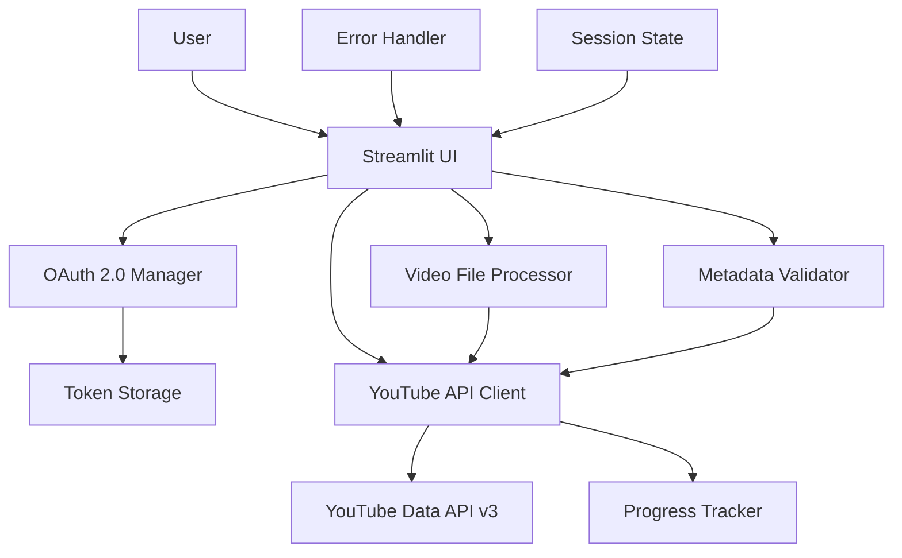
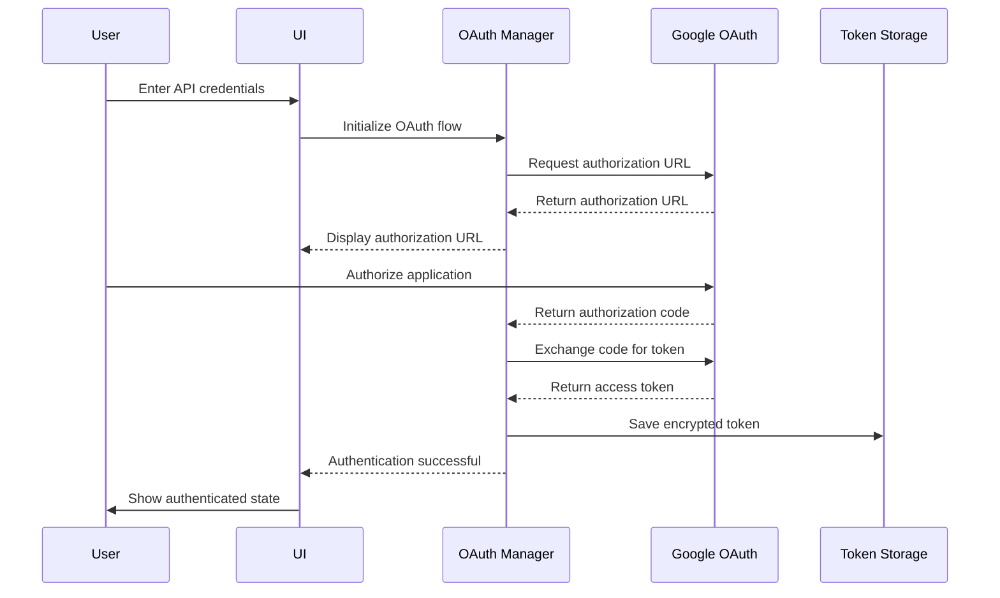
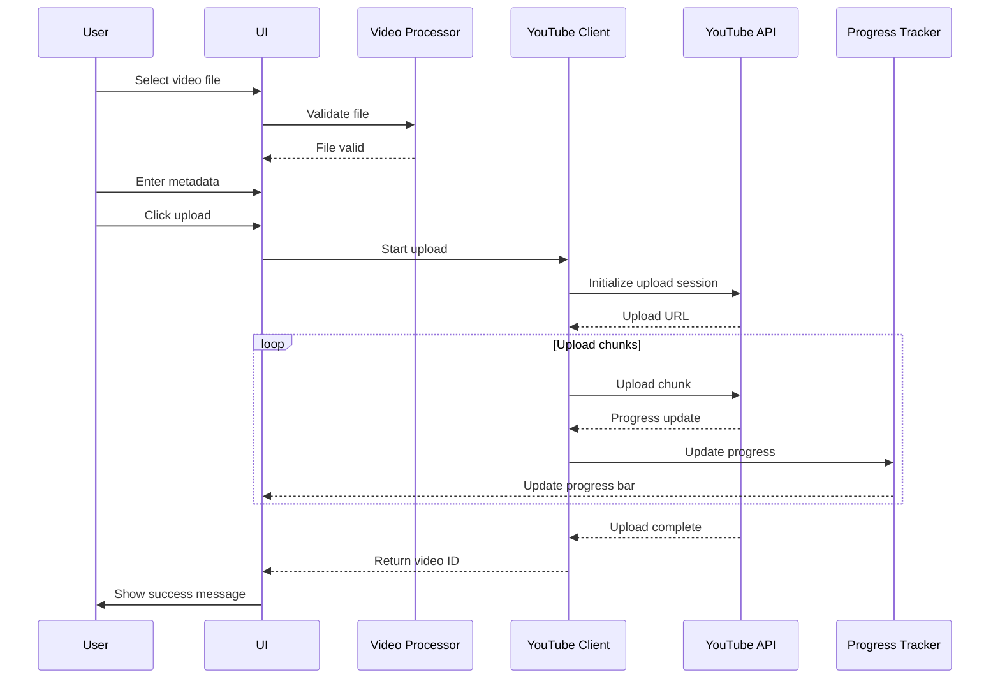

# YouTube Video Uploader Application - Implementation Plan

## Project Overview
A complete, self-contained Streamlit application for uploading local video files to YouTube using the YouTube Data API v3. The application uses uv for dependency management and includes OAuth 2.0 authentication with token persistence.

## Architecture Overview



## Technology Stack

- **Frontend Framework**: Streamlit 1.28+
- **API Client**: Google API Python Client 2.100+
- **Authentication**: OAuth 2.0 with google-auth-oauthlib
- **Package Manager**: uv (fast Python package installer)
- **Python Version**: 3.10+
- **File Storage**: Local filesystem for tokens and temporary files

## Project Structure

```
youtube-helper/
├── app.py                          # Main Streamlit application
├── youtube_client.py               # YouTube API client wrapper
├── oauth_manager.py                # OAuth 2.0 authentication manager
├── config.py                       # Application configuration
├── requirements.txt                # Python dependencies
├── pyproject.toml                  # uv project configuration
├── start.sh                        # Unix/macOS startup script
├── start.bat                       # Windows startup script
├── .streamlit/
│   └── config.toml                # Streamlit configuration
├── data/
│   └── tokens/                    # OAuth token storage
├── logs/                          # Application logs
├── docs/
│   ├── SETUP.md                   # Setup instructions
│   ├── API_SETUP.md               # YouTube API setup guide
│   └── TROUBLESHOOTING.md         # Troubleshooting guide
└── README.md                      # Project overview
```

## Core Components

### 1. OAuth 2.0 Authentication Manager (`oauth_manager.py`)

**Purpose**: Handle YouTube API authentication with token persistence

**Key Features**:
- OAuth 2.0 flow implementation
- Token storage in local filesystem (encrypted)
- Automatic token refresh
- Session-based authentication state
- Credential validation

**Key Functions**:
- `get_authenticated_service()`: Returns authenticated YouTube service
- `save_credentials(credentials)`: Persist credentials to disk
- `load_credentials()`: Load credentials from disk
- `refresh_token_if_needed()`: Auto-refresh expired tokens
- `clear_credentials()`: Clear stored credentials

**Security Considerations**:
- Store tokens in `data/tokens/` directory
- Encrypt sensitive data using Fernet encryption
- Never expose client secrets in code
- Implement token expiration checks

### 2. YouTube API Client (`youtube_client.py`)

**Purpose**: Wrapper for YouTube Data API v3 operations

**Key Features**:
- Video upload with resumable uploads
- Chunked upload for large files
- Progress tracking callbacks
- Metadata validation
- Error handling and retry logic

**Key Functions**:
- `upload_video(file_path, metadata, progress_callback)`: Upload video
- `validate_video_file(file_path)`: Validate file format and size
- `get_upload_status(upload_id)`: Check upload status
- `cancel_upload(upload_id)`: Cancel in-progress upload
- `get_video_categories()`: Fetch available video categories

**Upload Flow**:
1. Initialize resumable upload session
2. Upload video in chunks (typically 1-5 MB)
3. Report progress via callback
4. Handle network errors with exponential backoff
5. Complete upload and return video ID

### 3. Streamlit UI (`app.py`)

**Purpose**: User interface for the application

**Layout**:
- **Sidebar**:
  - API credentials input (Client ID, Client Secret)
  - Authentication status display
  - Login/Logout buttons
  - Connection test button
  - Settings (chunk size, retry attempts)

- **Main Area**:
  - Video file uploader
  - Metadata input form:
    - Title (required)
    - Description (optional)
    - Tags (comma-separated)
    - Category dropdown
    - Privacy status (public, unlisted, private)
  - Upload button
  - Progress bar
  - Status messages
  - Success/error notifications

**State Management**:
- Use Streamlit session state for:
  - Authentication status
  - Uploaded file info
  - Upload progress
  - Error messages
  - Success notifications

**User Experience**:
- Clear visual feedback for all actions
- Loading indicators for API calls
- Success/error toasts
- Responsive design
- Input validation with helpful error messages

### 4. Configuration (`config.py`)

**Purpose**: Centralized application configuration

**Settings**:
- API scopes (https://www.googleapis.com/auth/youtube.upload)
- Upload chunk size (default: 5 MB)
- Retry attempts (default: 3)
- Retry delay (default: 1 second with exponential backoff)
- Token storage path
- Log file path
- Max file size (256 GB - YouTube limit)

### 5. Startup Scripts

**Unix/macOS (`start.sh`)**:
```bash
#!/bin/bash
# Check if uv is installed
if ! command -v uv &> /dev/null; then
    echo "Installing uv..."
    curl -LsSf https://astral.sh/uv/install.sh | sh
fi

# Create virtual environment if it doesn't exist
if [ ! -d ".venv" ]; then
    echo "Creating virtual environment..."
    uv venv
fi

# Activate virtual environment
source .venv/bin/activate

# Install dependencies
echo "Installing dependencies..."
uv pip install -r requirements.txt

# Create necessary directories
mkdir -p data/tokens logs

# Start Streamlit application
streamlit run app.py
```

**Windows (`start.bat`)**:
```batch
@echo off
REM Check if uv is installed
where uv >nul 2>nul
if %ERRORLEVEL% NEQ 0 (
    echo Installing uv...
    powershell -c "irm https://astral.sh/uv/install.ps1 | iex"
)

REM Create virtual environment if it doesn't exist
if not exist ".venv" (
    echo Creating virtual environment...
    uv venv
)

REM Activate virtual environment
call .venv\Scripts\activate.bat

REM Install dependencies
echo Installing dependencies...
uv pip install -r requirements.txt

REM Create necessary directories
if not exist "data\tokens" mkdir data\tokens
if not exist "logs" mkdir logs

REM Start Streamlit application
streamlit run app.py
```

## Data Flow

### Authentication Flow



### Video Upload Flow



## Error Handling Strategy

### Error Categories

1. **Authentication Errors**:
   - Invalid credentials
   - Expired tokens
   - Authorization revoked
   - Handle: Show error, prompt re-authentication

2. **File Validation Errors**:
   - Invalid file format
   - File too large (>256 GB)
   - Corrupted file
   - Handle: Show specific error message, prevent upload

3. **API Quota Errors**:
   - Daily quota exceeded
   - Rate limit exceeded
   - Handle: Show quota info, suggest retry later

4. **Network Errors**:
   - Connection timeout
   - Network interruption
   - Handle: Retry with exponential backoff, show progress

5. **Upload Errors**:
   - Upload interrupted
   - Server error
   - Handle: Resume upload if possible, show error

### Error Handling Implementation

```python
# Error handling pattern
try:
    result = youtube_client.upload_video(file_path, metadata, progress_callback)
except AuthenticationError as e:
    st.error(f"Authentication failed: {str(e)}")
    st.info("Please check your API credentials and try again.")
except FileValidationError as e:
    st.error(f"Invalid file: {str(e)}")
except QuotaExceededError as e:
    st.error(f"API quota exceeded: {str(e)}")
    st.info(f"Quota resets at: {e.reset_time}")
except NetworkError as e:
    st.warning(f"Network error: {str(e)}")
    st.info("Retrying...")
except UploadError as e:
    st.error(f"Upload failed: {str(e)}")
except Exception as e:
    st.error(f"Unexpected error: {str(e)}")
    logger.error(f"Unexpected error: {str(e)}", exc_info=True)
```

## Security Considerations

1. **API Credentials**:
   - Never hardcode credentials in code
   - Store in Streamlit secrets or environment variables
   - Use Streamlit's secrets management for production

2. **Token Storage**:
   - Encrypt tokens using Fernet encryption
   - Store in user's home directory or project directory
   - Set appropriate file permissions (600)

3. **Data Validation**:
   - Validate all user inputs
   - Sanitize metadata to prevent injection attacks
   - Limit file size to YouTube's maximum (256 GB)

4. **Session Management**:
   - Clear sensitive data from session state when done
   - Implement logout functionality
   - Token expiration checks

## Performance Considerations

1. **Upload Optimization**:
   - Use resumable uploads for large files
   - Optimal chunk size (5-10 MB)
   - Parallel chunk uploads where possible

2. **Caching**:
   - Cache video categories
   - Cache authentication status
   - Cache API responses where appropriate

3. **Resource Management**:
   - Clean up temporary files
   - Close network connections properly
   - Manage memory for large file uploads

## Testing Strategy

### Unit Tests
- OAuth manager functions
- Video file validation
- Metadata validation
- Error handling

### Integration Tests
- YouTube API client operations
- OAuth flow with test credentials
- Upload process with test video

### Manual Testing Checklist
- [ ] Authentication flow works correctly
- [ ] Token persistence works across sessions
- [ ] Video upload completes successfully
- [ ] Progress bar updates accurately
- [ ] Error messages are clear and helpful
- [ ] All metadata fields work correctly
- [ ] Privacy status options work
- [ ] File validation prevents invalid uploads
- [ ] Network errors are handled gracefully
- [ ] Startup scripts work on all platforms

## Deployment Considerations

### Local Development
- Use startup scripts for easy launch
- Store credentials in `.streamlit/secrets.toml`
- Use virtual environment with uv

### Production (if needed)
- Use Streamlit Cloud or self-hosted
- Environment variables for credentials
- HTTPS for secure OAuth flow
- Regular security updates

## Documentation Requirements

1. **README.md**: Project overview, features, quick start
2. **SETUP.md**: Detailed setup instructions
3. **API_SETUP.md**: YouTube API console setup guide
4. **TROUBLESHOOTING.md**: Common issues and solutions
5. **Code comments**: Clear documentation of complex logic

## Success Criteria

- [ ] Application launches with double-click on startup script
- [ ] OAuth 2.0 authentication works with token persistence
- [ ] Video uploads complete successfully with progress tracking
- [ ] All metadata fields work correctly
- [ ] Comprehensive error handling for all failure scenarios
- [ ] Clean, polished UI with good UX
- [ ] Complete documentation
- [ ] Works on Windows, macOS, and Linux
- [ ] Production-ready code quality
- [ ] Security best practices implemented

## Implementation Order

1. Project structure and configuration files
2. OAuth 2.0 authentication manager
3. YouTube API client wrapper
4. Streamlit UI components
5. Integration and testing
6. Startup scripts
7. Documentation
8. Final testing and validation
